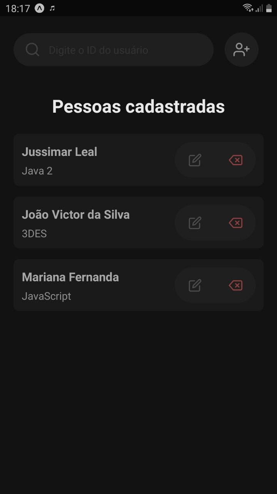
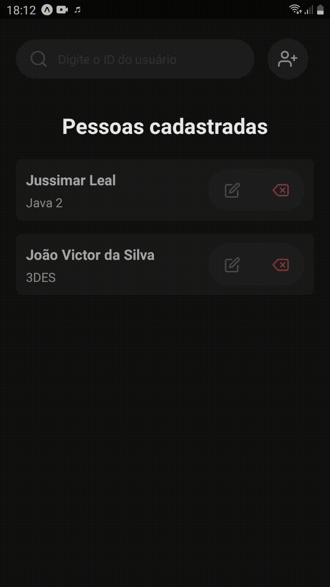

# Consumindo API com React Native - API do professor

> Aplicação desenvolvida como tarefa na materia de PAM. Foi usado React Native, Axios para requisições, e uma API disponibilizada pelo professor;

 

### Tela Inicial

### Gif mostrando a aplicação

> obs: a qualidade do gif está baixa

